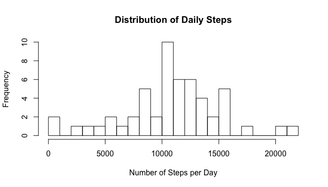

# Reproducible Research: Peer Assessment 1

## Inroduction
This is an R Markdown document produced for Peer Assessment 1 in the 5th course
(Reproducible Research) of the Data Science Specialization on Coursera. The
underlying data is from a personal activity monitoring device. This device 
collects data at 5 minute intervals through out the day. The data consists of 
two months of data from an anonymous individual collected during the months of 
October and November, 2012 and include the number of steps taken in 5 minute 
intervals each day.


## Loading and preprocessing the data
If the original data with the source file is not available yet, it is 
downloaded and unziped in the subdirectory `data`.  


```r
if(!file.exists("data")) {
        dir.create("data")
}
if(!file.exists('./activity.zip')) {
        fileUrl <- "https://d396qusza40orc.cloudfront.net/repdata%2Fdata%2Factivity.zip"
        download.file(fileUrl,
                      destfile="./activity.zip",
                      method="curl")
        dateDownloaded <- date()
}
if(!file.exists('./data/activity.csv')) {
        unzip("./activity.zip", exdir="./data/")                
}
data <- read.csv("./data/activity.csv")
```

Now the data is available in a data frame with variables:

* `data$steps`

* `data$date`

* `data$interval`

## What is mean total number of steps taken per day?

To calculate some statistical properties about steps taken per day the
data is aggregated per day. Additionally, median and mean is computed.


```r
daily_steps <- aggregate(data[,'steps'], by = list(data$date), FUN = sum)
median_steps_per_day <- median(daily_steps$x, na.rm=TRUE)
mean_steps_per_day = mean(daily_steps$x, na.rm=TRUE)
mean_steps_per_day_string <- prettyNum(mean_steps_per_day, digits = 0,
                                       big.mark = ",", scientific = FALSE)
```

This histogram shows the distribution of daily steps.


```r
hist(daily_steps$x, breaks=20, 
     main="Distribution of Daily Steps", 
     xlab="Number of Steps per Day")
```

 

The mean steps per day are 10,766 
(exact: 1.0766189\times 10^{4}) and the median steps per day are
10765.

## What is the average daily activity pattern?

The average daily activity pattern uses the average steps per 5-min
interval.


```r
interval_steps <- aggregate(data[,'steps'], 
                            by = list(data$interval), 
                            FUN = mean, 
                            na.rm = TRUE)
max_steps <- max(interval_steps$x)
max_steps_time <- interval_steps$Group.1[which.max(interval_steps$x)]
max_steps_string <- paste(max_steps_time %/% 100, max_steps_time %% 100, 
                          sep=':')
```

This line plot shows the activity pattern of average steps over the course of
a day.


```r
start_time <- as.POSIXct(strptime("1970-01-01 00:00:00", "%Y-%m-%d %H:%M:%S"))
end_time <- as.POSIXct(strptime("1970-01-01 23:55:01", "%Y-%m-%d %H:%M:%S"))
with(interval_steps, {
        time <- strptime(paste(1970, 1, Group.1 %/% 100, Group.1 %% 100),
                         "%Y %j %H %M")
        plot(time, x, type = 'l', xaxt = 'n',
             xlab='Hours of Day', ylab='steps', main='Activity Pattern')
        axis.POSIXct(1, at = seq(start_time, end_time, by="hours"), 
                     format = "%H")
})
```

 

The most average steps (206) on a day are at 
8:35.

## Imputing missing values
Only 15264 out of 
17568 records are complete. As (very simple) strategy for filling
the missing values we use the general average of steps in an interval.


```r
data_complete <- data
data_complete[!complete.cases(data_complete$steps),'steps'] = 
        mean(data[complete.cases(data$steps),'steps'])
```

Now, we calculate again some statistical properties about steps taken per day
from the data with imputed values. Additionally, median and mean is computed.


```r
daily_steps_c <- aggregate(data_complete[,'steps'], 
                           by = list(data_complete$date), 
                           FUN = sum)
median_steps_per_day_c <- median(daily_steps_c$x)
median_steps_per_day_string_c <- prettyNum(median_steps_per_day_c, digits = 0,
                                           big.mark = ",", scientific = FALSE)
mean_steps_per_day_c <- mean(daily_steps_c$x)
mean_steps_per_day_string_c <- prettyNum(mean_steps_per_day_c, digits = 0,
                                         big.mark = ",", scientific = FALSE)
```

This histogram shows the distribution of daily steps with imputed data.


```r
hist(daily_steps_c$x, breaks=20, 
     main="Distribution of Daily Steps", 
     xlab="Number of Steps per Day")
```

 

The mean steps per day are 10,766 
(exact: 1.0766189\times 10^{4}) and the median steps per day are
10,766 (exact: 1.0766189\times 10^{4}).

###Explanation

Why is the distribution only affected in the 10,000 block? If we take a
look what values we are missing, we find the following result.


```r
tmp <- data[!complete.cases(data),'date']
head(sort(table(tmp), decreasing = TRUE),10)
```

```
## tmp
## 2012-10-01 2012-10-08 2012-11-01 2012-11-04 2012-11-09 2012-11-10 
##        288        288        288        288        288        288 
## 2012-11-14 2012-11-30 2012-10-02 2012-10-03 
##        288        288          0          0
```

So we find, that either a whole day is missing, or completly availalbe and 
this explaines the increase in only one bar of the histogram above and that
there is no change in the mean and median!

## Are there differences in activity patterns between weekdays and weekends?

To compare differences in activity patterns between weekdays and weekends, a
factor varialbe `data$day_type` is created.


```r
tmp_day <- (weekdays(as.POSIXct(data$date)) == "Sunday" | 
            weekdays(as.POSIXct(data$date)) == "Saturday")
data$day_type<-factor(tmp_day, labels=c("weekday", "weekend"))
```

The following line plots compare activity patterns between weekdays and 
weekends.


```r
library(lattice)
data_weekday <- aggregate(data[data$day_type=="weekday", 'steps'], 
                          by = list(data[data$day_type=="weekday",]$interval), 
                          FUN = mean, 
                          na.rm = TRUE)
data_weekday$daytime <- strptime(paste(1970, 1, data_weekday$Group.1 %/% 100, 
                          data_weekday$Group.1 %% 100), "%Y %j %H %M") 
data_weekday$day_type <- factor("weekday")
data_weekend <- aggregate(data[data$day_type=="weekend", 'steps'], 
                          by = list(data[data$day_type=="weekend",]$interval),
                          FUN = mean, 
                          na.rm = TRUE)
data_weekend$daytime <- strptime(paste(1970, 1, data_weekend$Group.1 %/% 100, 
                          data_weekend$Group.1 %% 100), "%Y %j %H %M") 
data_weekend$day_type <- factor("weekend")
data_all <- rbind(data_weekday, data_weekend)
xyplot(x ~ as.POSIXct(daytime) | day_type, 
       data=data_all, type='l', 
       scales=list(x=list(format = "%H")),
       xlab='Hours of Day', ylab="steps", 
       main='Differences in Activity Patterns')
```

 
